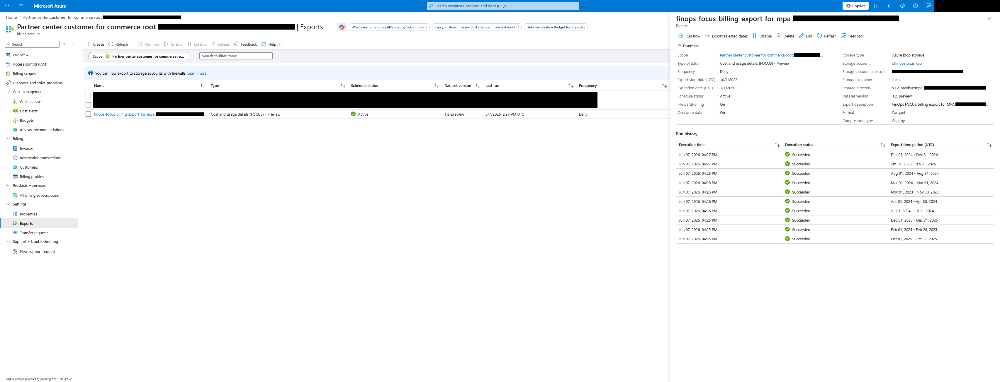
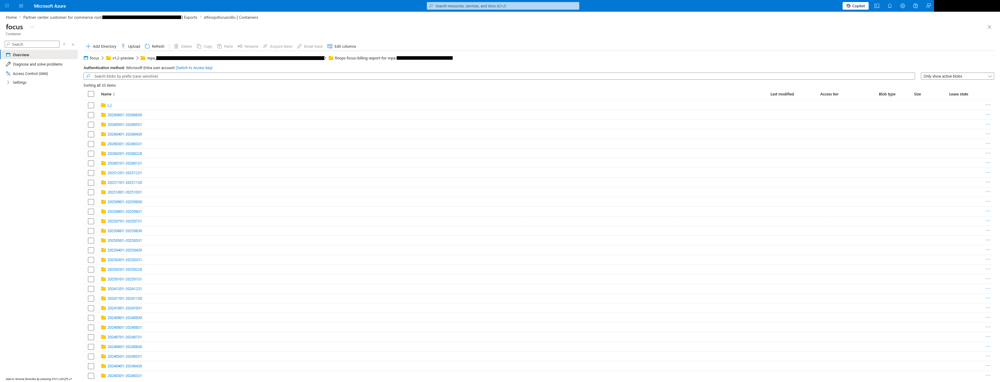

# FinOps FOCUS billing export for a Microsoft Partner Agreement (MPA)

This examples creates a FinOps FOCUS billing export scoped to a Microsoft Partner Agreement (MPA) billing account.



## Usage

First set the following variables:

- `var.mpa_id` - Id of the Microsoft Partner Agreement (MPA). It can be found via the Azure Portal (portal.azure.com) via "Cost Management + Billing > Billing scopes > Select your MPA > Settings > Properties > Billing account id"
- `var.subscription_id` - Id of the subscription used to create the resource group and storage account
- `var.tenant_id` - Id of the tenant where the subscription is

Additionally you can edit the `creation_date` to match the current date.

Then run the following commands to deploy the export:

```bash
# Init Terraform
terraform init

# Plan changes
terraform plan

# Apply
terraform apply
```

## Main code

```hcl
module "finops_focus_billing_export" {
  source  = "alexandre-pares/finops-focus-billing-export/azure"
  version = "2.1.0"

  name           = substr("finops-focus-billing-export-for-mpa-${var.mpa_id}", 0, 64) # Don't need to replace ":" by "_" as MPA id is already too long and will be trucated
  description    = "FinOps FOCUS billing export for MPA ${var.mpa_id}"
  export_version = "1.2-preview"
  scope_id       = "/providers/Microsoft.Billing/billingAccounts/${var.mpa_id}"

  storage_account_id = module.focus_billing_storage_account.resource_id
  container_name     = "focus"

  directory = "v1.2-preview/mpa_${replace(var.mpa_id, ":", "_")}" # Replace ":" with "_" for MPA Id

  creation_date = "2026-06-07"
  start_date    = "2023-10-01"
  end_date      = "2050-01-01"

  enable_backfill = true
}
```



<!-- BEGIN_TF_DOCS -->
## Requirements

| Name | Version |
| ---- | ------- |
| <a name="requirement_terraform"></a> [terraform](#requirement\_terraform) | ~> 1.8 |
| <a name="requirement_azapi"></a> [azapi](#requirement\_azapi) | 2.11.0 |

## Providers

| Name | Version |
| ---- | ------- |
| <a name="provider_azapi"></a> [azapi](#provider\_azapi) | 2.11.0 |

## Modules

| Name | Source | Version |
| ---- | ------ | ------- |
| <a name="module_finops_focus_billing_export"></a> [finops\_focus\_billing\_export](#module\_finops\_focus\_billing\_export) | ../.. | n/a |
| <a name="module_focus_billing_storage_account"></a> [focus\_billing\_storage\_account](#module\_focus\_billing\_storage\_account) | Azure/avm-res-storage-storageaccount/azurerm | 0.7.3 |
| <a name="module_naming"></a> [naming](#module\_naming) | Azure/naming/azurerm | 0.4.3 |
| <a name="module_resource_group"></a> [resource\_group](#module\_resource\_group) | Azure/avm-res-resources-resourcegroup/azurerm | 0.4.0 |

## Resources

| Name | Type |
| ---- | ---- |
| [azapi_client_config.current](https://registry.terraform.io/providers/Azure/azapi/2.11.0/docs/data-sources/client_config) | data source |

## Inputs

| Name | Description | Type | Default | Required |
| ---- | ----------- | ---- | ------- | :------: |
| <a name="input_mpa_id"></a> [mpa\_id](#input\_mpa\_id) | Id of the Microsoft Partner Agreement (MPA) billing account (used for the FinOps FOCUS billing export scope).<br/><br/>    Id can be found via the Azure Portal (portal.azure.com) via "Cost Management + Billing > Billing scopes > Select your MPA > Settings > Properties > Billing account id".<br/><br/>    Example:<br/><br/>    - `00000000-0000-4000-0000-000000000000:00000000-0000-4000-0000-000000000000_2018-09-30` | `string` | n/a | yes |
| <a name="input_subscription_id"></a> [subscription\_id](#input\_subscription\_id) | Id of the subscription. THis is used to create the resource group and storage account not the export.<br/><br/>    Example:<br/><br/>    - `00000000-0000-4000-0000-000000000000` | `string` | n/a | yes |
| <a name="input_tenant_id"></a> [tenant\_id](#input\_tenant\_id) | Id of the Azure tenant. | `string` | n/a | yes |

## Outputs

| Name | Description |
| ---- | ----------- |
| <a name="output_export_resource_id"></a> [export\_resource\_id](#output\_export\_resource\_id) | Id of the export.<br/><br/>  Example:<br/><br/>  - `/providers/Microsoft.Billing/billingAccounts/00000000-0000-4000-0000-000000000000:00000000-0000-4000-0000-000000000000_2018-09-30/providers/Microsoft.CostManagement/exports/finops-focus-billing-export-for-mpa-00000000-0000-4000-0000-0000` |
| <a name="output_months_backfilled"></a> [months\_backfilled](#output\_months\_backfilled) | List of months backfilled.<br/><br/>  Example if `var.start_date` is `2026-01` and `var.creation_date` is `2026-06-06`:<pre>hcl<br/>  [<br/>    {<br/>      end_date   = "2026-01-31T00:00:00Z"<br/>      start_date = "2026-01-01T00:00:00Z"<br/>    }<br/>    {<br/>      end_date   = "2026-02-28T00:00:00Z"<br/>      start_date = "2026-02-01T00:00:00Z"<br/>    }<br/>    {<br/>      end_date   = "2026-03-31T00:00:00Z"<br/>      start_date = "2026-03-01T00:00:00Z"<br/>    }<br/>    {<br/>      end_date   = "2026-04-30T00:00:00Z"<br/>      start_date = "2026-04-01T00:00:00Z"<br/>    }<br/>    {<br/>      end_date   = "2026-05-31T00:00:00Z"<br/>      start_date = "2026-05-01T00:00:00Z"<br/>    }<br/>    {<br/>      end_date   = "2026-06-06T00:00:00Z"<br/>      start_date = "2026-06-01T00:00:00Z"<br/>    }<br/>  ]</pre> |
<!-- END_TF_DOCS -->
