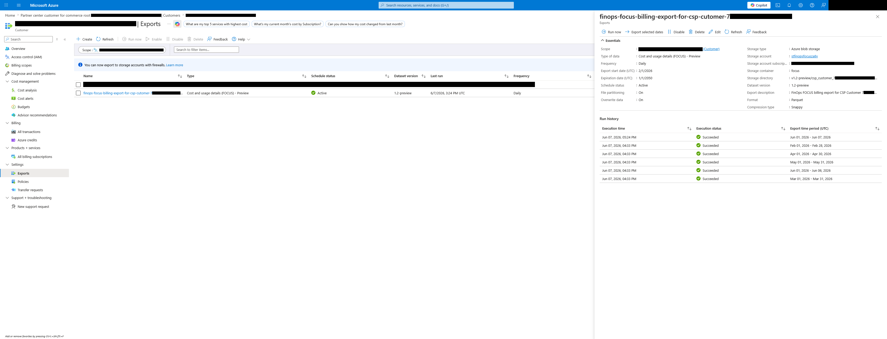
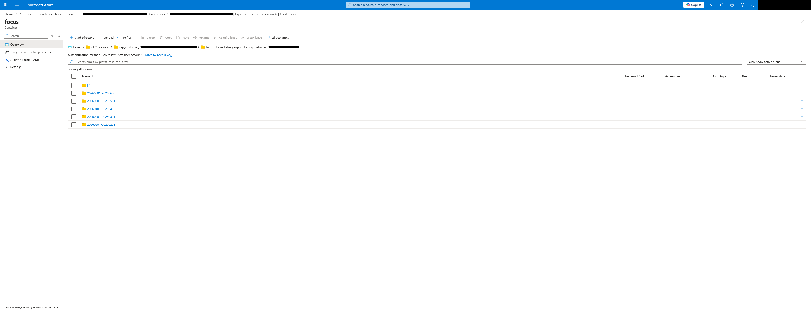

# FinOps FOCUS billing export for a CSP Customer

This examples creates a FinOps FOCUS billing export scoped to a CSP Customer attached to a Microsoft Customer Agreement (MCA) billing account.

Because this requires access to the MPA billing account, the CSP customer cannot create the export and must request his CSP to create the billing export for him. They can use this repo as template.

Additionally, we recommend setting up an object replication rule between the CSP and the customer tenant to allow the customer access to his billing dataset from his tenant.



## Usage

First set the following variables:

- `var.mpa_id` - Id of the Microsoft Partner Agreement (MPA). It can be found via the Azure Portal (portal.azure.com) via "Cost Management + Billing > Billing scopes > Select your MPA > Settings > Properties > Billing account id".
- `var.customer_id` - Id of the CSP Customer. It can be found via the Azure Portal (portal.azure.com) via "Cost Management + Billing > Billing scopes > Select your MPA > Billing > Select the Customer". Then extracted from the URL. Alternatively, you can find the customer Id from the Microsoft Partner Center (partner.microsoft.com) if you have GDAP (Granular Delegated Admin Relationships) via "Customers > Administer > Search the customer > Microsoft ID"
- `var.subscription_id` - Id of the subscription used to create the resource group and storage account
- `var.tenant_id` - Id of the tenant where the subscription is.

Additionally you can edit the `creation_date` to match the current date.

Then run the following commands to deploy the export:

```bash
# Init Terraform
terraform init

# Plan changes
terraform plan

# Apply
terraform apply
```

## Main code

```hcl
module "finops_focus_billing_export" {
  source  = "alexandre-pares/finops-focus-billing-export/azure"
  version = "2.1.1"

  name           = substr("finops-focus-billing-export-for-csp-cutomer-${var.customer_id}", 0, 64)
  description    = "FinOps FOCUS billing export for CSP Customer ${var.customer_id}"
  export_version = "1.2-preview"
  scope_id       = "/providers/Microsoft.Billing/billingAccounts/${var.mpa_id}/customers/${var.customer_id}"

  storage_account_id = module.focus_billing_storage_account.resource_id
  container_name     = "focus"

  directory = "v1.2-preview/csp_customer_${var.customer_id}"

  creation_date = "2026-07-25"
  start_date    = "2026-02-01"
  end_date      = "2050-01-01"

  enable_backfill = true
}
```



<!-- BEGIN_TF_DOCS -->
## Requirements

| Name | Version |
| ---- | ------- |
| <a name="requirement_terraform"></a> [terraform](#requirement\_terraform) | ~> 1.8 |
| <a name="requirement_azapi"></a> [azapi](#requirement\_azapi) | 2.11.0 |

## Providers

| Name | Version |
| ---- | ------- |
| <a name="provider_azapi"></a> [azapi](#provider\_azapi) | 2.11.0 |

## Modules

| Name | Source | Version |
| ---- | ------ | ------- |
| <a name="module_finops_focus_billing_export"></a> [finops\_focus\_billing\_export](#module\_finops\_focus\_billing\_export) | ../.. | n/a |
| <a name="module_focus_billing_storage_account"></a> [focus\_billing\_storage\_account](#module\_focus\_billing\_storage\_account) | Azure/avm-res-storage-storageaccount/azurerm | 0.7.3 |
| <a name="module_naming"></a> [naming](#module\_naming) | Azure/naming/azurerm | 0.4.3 |
| <a name="module_resource_group"></a> [resource\_group](#module\_resource\_group) | Azure/avm-res-resources-resourcegroup/azurerm | 0.4.0 |

## Resources

| Name | Type |
| ---- | ---- |
| [azapi_client_config.current](https://registry.terraform.io/providers/Azure/azapi/2.11.0/docs/data-sources/client_config) | data source |

## Inputs

| Name | Description | Type | Default | Required |
| ---- | ----------- | ---- | ------- | :------: |
| <a name="input_customer_id"></a> [customer\_id](#input\_customer\_id) | Id of the Customer attached to a Microsoft Partner Agreement (MPA) billing account (used for the FinOps FOCUS billing export scope).<br/><br/>    Id can be found via the Azure Portal (portal.azure.com) via "Cost Management + Billing > Billing scopes > Select your MPA > Billing > Select the Customer".<br/>    Then extract from the url the customer Id "customers%2F00000000-0000-4000-0000-000000000000/scope/Customer" where "00000000-0000-4000-0000-000000000000" is your customer id.<br/><br/>    Alternatively, you can find the customer Id from the Microsoft Partner Center (partner.microsoft.com) if you have GDAP (Granular Delegated Admin Relationships) via "Customers > Administer > Search the customer > Microsoft ID"<br/><br/>    Example:<br/><br/>    - `00000000-0000-4000-0000-000000000000` | `string` | n/a | yes |
| <a name="input_mpa_id"></a> [mpa\_id](#input\_mpa\_id) | Id of the Microsoft Partner Agreement (MPA) billing account (used for the FinOps FOCUS billing export scope).<br/><br/>    Id can be found via the Azure Portal (portal.azure.com) via "Cost Management + Billing > Billing scopes > Select your MPA > Settings > Properties > Billing account id".<br/><br/>    Example:<br/><br/>    - `00000000-0000-4000-0000-000000000000:00000000-0000-4000-0000-000000000000_2018-09-30` | `string` | n/a | yes |
| <a name="input_subscription_id"></a> [subscription\_id](#input\_subscription\_id) | Id of the subscription. THis is used to create the resource group and storage account not the export.<br/><br/>    Example:<br/><br/>    - `00000000-0000-4000-0000-000000000000` | `string` | n/a | yes |
| <a name="input_tenant_id"></a> [tenant\_id](#input\_tenant\_id) | Id of the Azure tenant. | `string` | n/a | yes |

## Outputs

| Name | Description |
| ---- | ----------- |
| <a name="output_export_resource_id"></a> [export\_resource\_id](#output\_export\_resource\_id) | Id of the export.<br/><br/>  Example:<br/><br/>  - `/providers/Microsoft.Billing/billingAccounts/00000000-0000-4000-0000-000000000000:00000000-0000-4000-0000-000000000000_2018-09-30/customers/00000000-0000-4000-0000-000000000000/providers/Microsoft.CostManagement/exports/finops-focus-billing-export-for-csp-cutomer-00000000-0000-4000-0` |
| <a name="output_months_backfilled"></a> [months\_backfilled](#output\_months\_backfilled) | Map of months to backfill, empty map will be returned if `var.enable_backfill` is `false`:<br/><br/>  - `start_date` Start date of the month aligned with RFC 3339<br/>  - `end_date` End date of the month, aligned with RFC 3339<br/><br/>  Example if `var.start_date` is `2026-01`, `var.creation_date` is `2026-07-25` and `var.enable_backfill` is `true`:<pre>hcl<br/>  {<br/>    "2026-01" = {<br/>      "end_date" = "2026-01-31T00:00:00Z"<br/>      "start_date" = "2026-01-01T00:00:00Z"<br/>    }<br/>    "2026-02" = {<br/>      "end_date" = "2026-02-28T00:00:00Z"<br/>      "start_date" = "2026-02-01T00:00:00Z"<br/>    }<br/>    "2026-03" = {<br/>      "end_date" = "2026-03-31T00:00:00Z"<br/>      "start_date" = "2026-03-01T00:00:00Z"<br/>    }<br/>    "2026-04" = {<br/>      "end_date" = "2026-04-30T00:00:00Z"<br/>      "start_date" = "2026-04-01T00:00:00Z"<br/>    }<br/>    "2026-05" = {<br/>      "end_date" = "2026-05-31T00:00:00Z"<br/>      "start_date" = "2026-05-01T00:00:00Z"<br/>    }<br/>    "2026-06" = {<br/>      "end_date" = "2026-06-30T00:00:00Z"<br/>      "start_date" = "2026-06-01T00:00:00Z"<br/>    }<br/>    "2026-07" = {<br/>      "end_date" = "2026-07-25T00:00:00Z"<br/>      "start_date" = "2026-07-01T00:00:00Z"<br/>    }<br/>  }</pre> |
| <a name="output_storage_account_id"></a> [storage\_account\_id](#output\_storage\_account\_id) | Id of the storage account containing the FinOps FOCUS billing export.<br/><br/>  Example:<br/><br/>  - `/subscriptions/00000000-0000-4000-0000-000000000000/resourceGroups/rg-finops-focus-abcd/providers/Microsoft.Storage/storageAccounts/stfinopsfocusabcd` |
<!-- END_TF_DOCS -->
